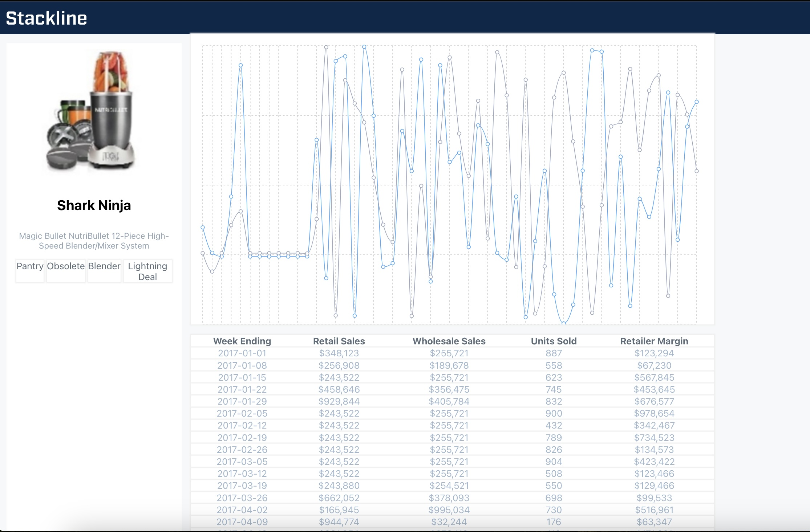

# Commands used

### npm create-react-app stackline

### npm install gh-pages recharts @reduxjs/toolkit

### npm run build

### npm run deploy

### npm install typescript @types/node @types/react @types/react-dom @types/react-redux

# Additional changes

## tsconfig.json additions

add "moduleResolution": "node" to ensure all node_modules can be located in a ts file

add "resolveJsonModule": true to make sure json files are recognised; also add data type wherever it is used. refer dataSlice.ts line 12

to make sure assets are recognised; create custom.d.ts and add all types of file types that could be imported into tsx files like jpg, png, svg etc

# Final UI Screen

# HyperLink to deployed page

https://aamrahms.github.io/stackline/
